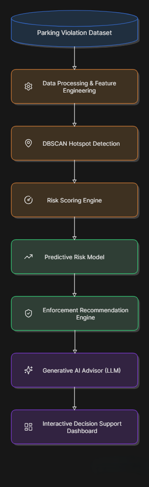
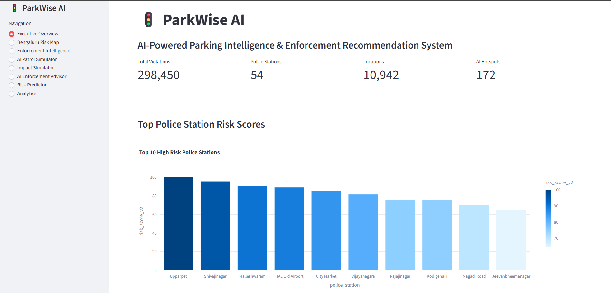
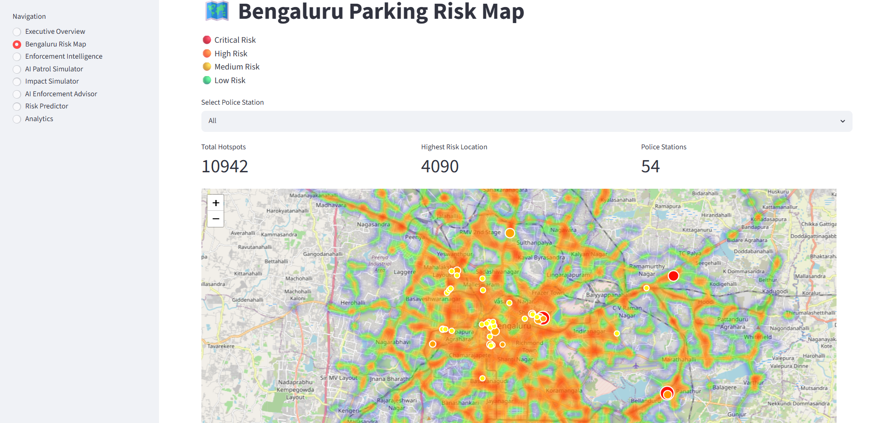
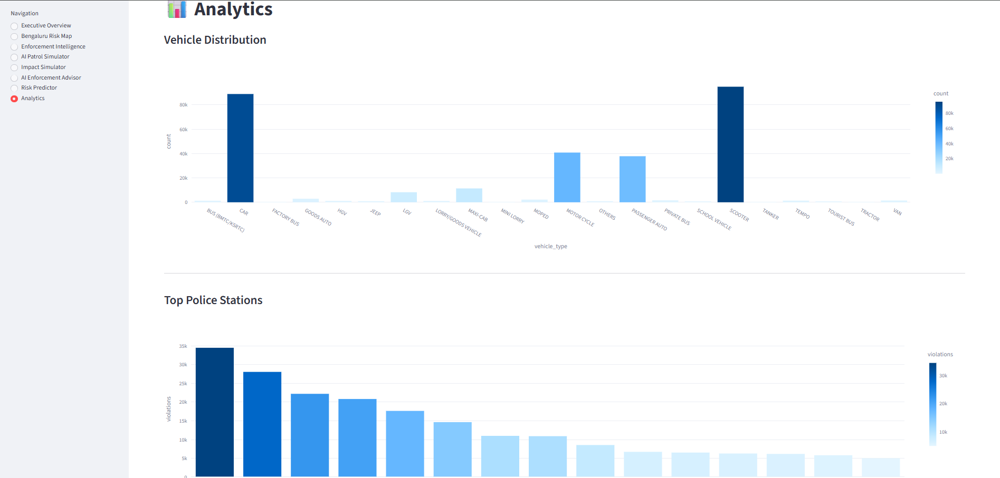
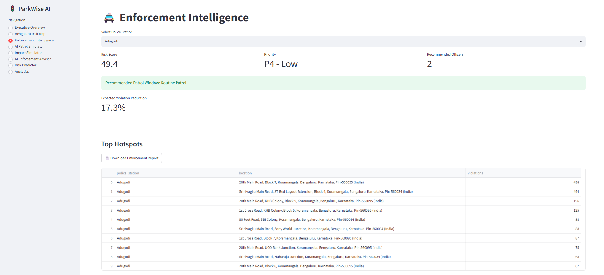
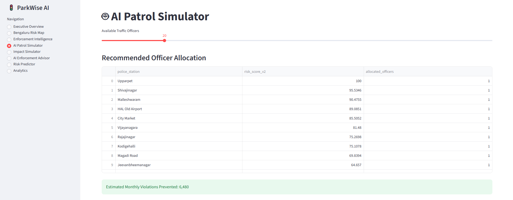
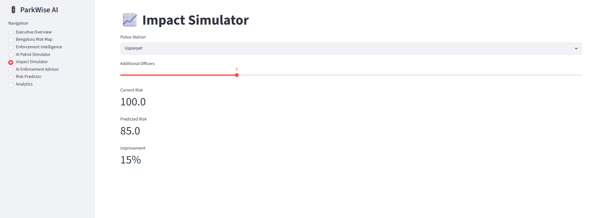
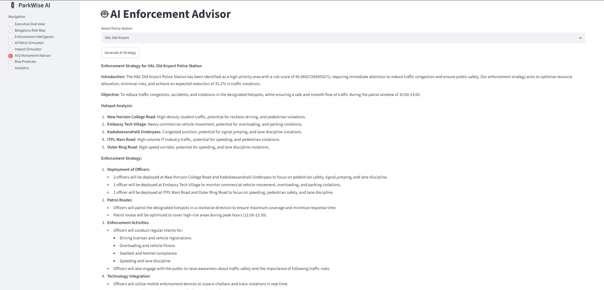
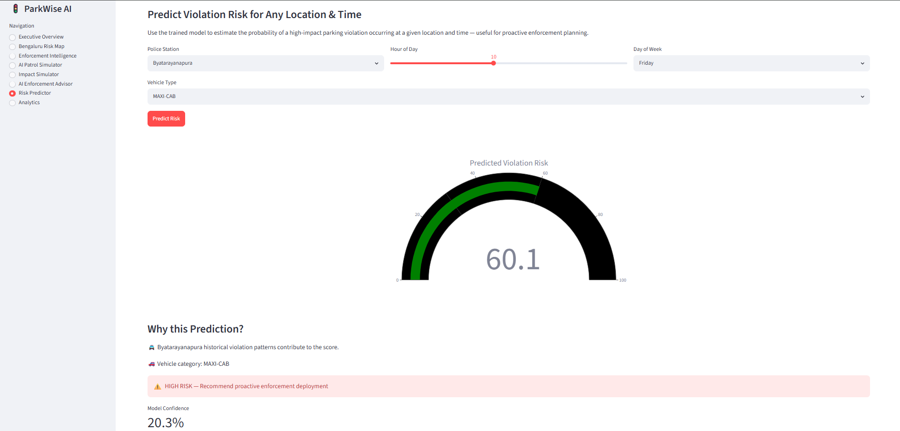

# 🚦 ParkWise AI

### AI-Powered Parking Intelligence & Enforcement Recommendation Platform for Bengaluru

ParkWise AI is an intelligent traffic enforcement and parking analytics platform designed to help authorities identify parking-induced congestion hotspots, prioritize enforcement actions, optimize resource allocation, and reduce traffic disruptions through Machine Learning, Geospatial Analytics, and Generative AI.

---

## 📌 Problem Statement

Illegal parking and spillover parking around commercial areas, transit hubs, markets, and major road corridors significantly reduce roadway capacity and contribute to congestion across Bengaluru.

Current enforcement methods are largely reactive, making it difficult to:

* Identify high-impact parking hotspots
* Prioritize enforcement zones
* Optimize officer deployment
* Measure enforcement effectiveness
* Generate actionable operational intelligence

---

## 💡 Solution

ParkWise AI transforms historical parking violation data into actionable enforcement intelligence.

The platform combines:

* Machine Learning-based hotspot detection
* Predictive risk assessment
* Geospatial analytics
* Officer allocation recommendations
* Impact simulation
* AI-powered enforcement strategy generation

to support smarter and more efficient traffic management.

---

# 🏗️ System Architecture



---

# 🚀 Key Features

## 1️⃣ Executive Overview Dashboard

Provides city-wide parking intelligence including:



* Total Violations
* Police Stations Covered
* Identified Locations
* AI-Detected Hotspots
* Risk Ranking Overview

---

## 2️⃣ Bengaluru Risk Map

Interactive geospatial visualization featuring:



* Parking violation hotspots
* Risk heatmaps
* Priority zones
* Police station coverage
* Congestion-prone corridors

---

## 3️⃣ AI Hotspot Detection

Uses DBSCAN (Density-Based Spatial Clustering) to identify:



* Illegal parking clusters
* High-density violation zones
* Emerging congestion hotspots

### Results

* 298,450 Violation Records Analyzed
* 10,942 Unique Locations
* 54 Police Stations
* 172 AI-Detected Hotspots

---

## 4️⃣ Enforcement Intelligence

Provides:



* Police station risk ranking
* Recommended patrol windows
* Recommended officer allocation
* Priority categorization

---

## 5️⃣ AI Patrol Simulator

Simulates:



* Officer deployment plans
* Resource allocation strategies
* Coverage optimization

---

## 6️⃣ Impact Simulator

Allows authorities to estimate:



* Potential violation reduction
* Enforcement effectiveness
* Resource utilization impact

---

## 7️⃣ AI Enforcement Advisor

Powered by Large Language Models (LLMs).

Generates:



* Enforcement recommendations
* Patrol strategies
* Operational insights
* Action plans for traffic authorities

---

## 8️⃣ Predictive Risk Assessment

Machine Learning model predicts future parking violation risk using:



* Location
* Vehicle Type
* Time of Day
* Day of Week

Outputs:

* Risk Probability
* Confidence Score
* Risk Category

---

## 📊 Dataset Overview

The solution was developed using Bengaluru parking violation records containing:

* Violation Locations
* Vehicle Categories
* Police Stations
* Timestamps
* Violation Types
* Geospatial Coordinates

---

## 🧠 AI & Machine Learning Components

### Unsupervised Learning

**DBSCAN Clustering**

Used for:

* Hotspot Detection
* Spatial Pattern Discovery
* Congestion Risk Identification

### Predictive Analytics

Machine Learning Risk Prediction Model

Used for:

* Future Violation Risk Assessment
* Enforcement Planning

### Generative AI

Large Language Model Integration

Used for:

* AI Enforcement Advisor
* Strategy Generation
* Decision Support

---

# 🛠️ Technology Stack

### Frontend

* Streamlit

### Data Processing

* Pandas
* NumPy

### Machine Learning

* Scikit-Learn
* XGBoost
* DBSCAN

### Visualization

* Plotly
* Folium
* Streamlit-Folium

### AI

* Groq API
* Llama 3.3 70B

### Deployment

* Hugging Face Spaces

---

# 📂 Project Structure

```text
parkwise-ai
│
├── app.py
├── requirements.txt
├── README.md
│
├── data
│   ├── processed
│   └── new
│      └── model.pkl
│
├── utils
│   ├── ai_advisor.py
│ 
└──
```

---

# ⚙️ Installation

Clone the repository:

```bash
git clone <repository-url>
cd parkwise-ai
```

Install dependencies:

```bash
pip install -r requirements.txt
```

Configure environment variables:

```bash
GROQ_API_KEY=your_api_key
```

Run the application:

```bash
streamlit run app.py
```

---

# 🎯 Impact

ParkWise AI enables traffic authorities to answer:

* Where should enforcement resources be deployed?
* Which parking hotspots contribute most to congestion?
* When should patrols be scheduled?
* What intervention strategy is most effective?
* How can limited resources be utilized efficiently?

The platform supports data-driven traffic management and contributes to smarter urban mobility.

---

# 👨‍💻 Developed By

**Jay Dhanwalkar**

MCA Graduate | Software Engineering Enthusiast | AI & Data Analytics Developer

---

# 🏆 Hackathon Submission

Developed for:

**Bengaluru Traffic Police × Flipkart Grid 2.0 Hackathon**

Theme:

**Poor Visibility on Parking-Induced Congestion**
